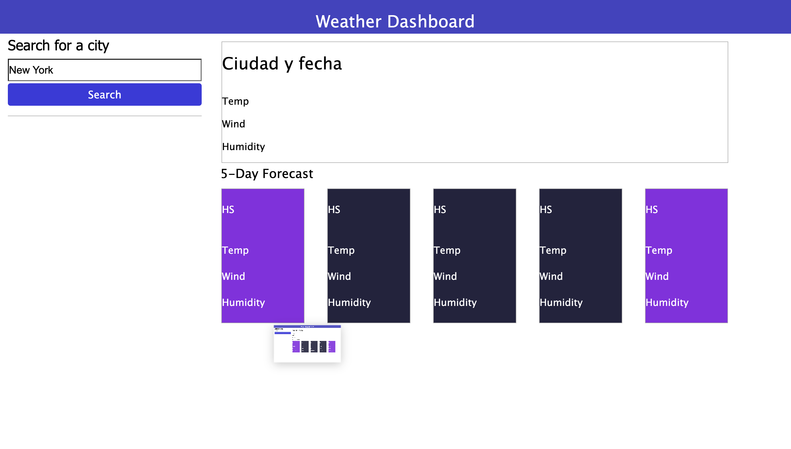
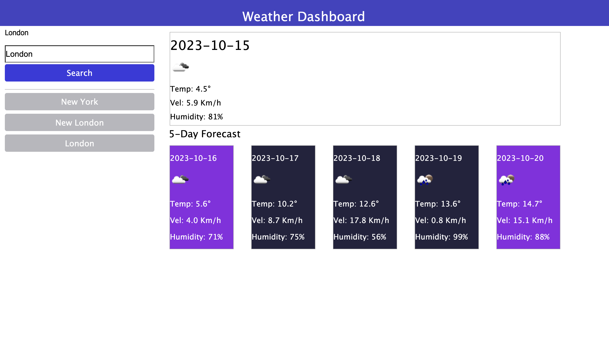

# Weather App README

This is a simple weather application that allows users to search for weather information for a given city. The app fetches weather data from the OpenWeatherMap API using the provided API key.

## Getting Started

To use this application, follow the steps below:

1. Clone or download this repository to your local machine.

2. Open the `index.html` file in a web browser.

3. Enter the name of a city in the input field and click the "Search" button to retrieve weather information for that city.

4. The application will display the weather forecast for the selected city, including temperature, wind speed, humidity, and icons representing weather conditions.

## Features

- **Search for Weather**: Enter the name of a city and click the "Search" button to get weather information.

- **Search History**: The application keeps track of the last 15 searched cities and displays them in a list. You can click on a city in the list to retrieve its weather information.

## Screenshots

<!-- Add additional screenshots here -->

## Troubleshooting

- If the weather data is not available, the application will display an error message.

- Make sure to enter a valid city name for accurate weather information.

## Developer Notes

- This application uses the OpenWeatherMap API to fetch weather data. Ensure that the API key (`apiKey`) is valid and up to date.

- The code is written in JavaScript and utilizes the Fetch API for making API requests.

- The search history functionality allows you to quickly access weather information for previously searched cities.

- To save and retrieve the search history, consider implementing local storage functionality.

## Contributing

If you would like to contribute to this project, feel free to create a pull request or submit an issue in the repository.

